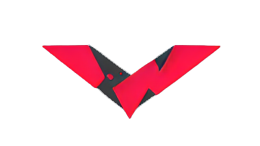
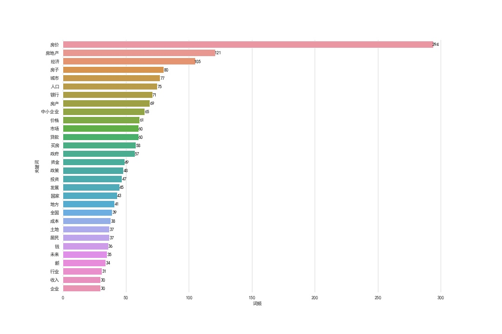
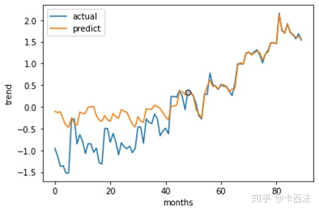
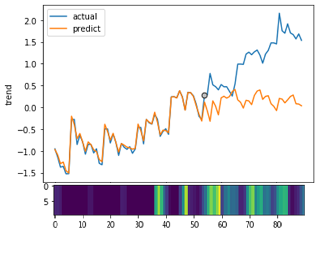

[![Contributors][contributors-shield]][contributors-url]
[![Forks][forks-shield]][forks-url]
[![Stargazers][stars-shield]][stars-url]
[![Issues][issues-shield]][issues-url]

  

<h1 style="display: inline-block;">Seq2seq-attention House Price Prediction</h1>

      <a href="https://zhuanlan.zhihu.com/p/106122616"><strong>知乎文章 -> Zhihu Article »</strong></a>
       
  

    <a href="https://github.com/dr413677671/Seq2seq-attention-house-price-prediction/issues">Report Bug</a>
    ·
    <a href="https://github.com/dr413677671/Seq2seq-attention-house-price-prediction/issues">Request Feature</a>
  

<!-- ABOUT THE PROJECT -->

<!-- 

 -->

## About this project

Seq2seq-attention house price prediction. See [Zhihu Article »](https://zhuanlan.zhihu.com/p/106122616)

基于Seq2seq-attention的房价预测，详见 [知乎文章 »](https://zhuanlan.zhihu.com/p/106122616)

## Features:

- [x] Model
    - [x] LSTM
- [ ] Data Augmentation
- [ ] Hyperparameter Search
- [x] Feature Engineering
- [x] Others
    - [x] Standardlization

(<a href="#readme-top">back to top</a>)

### Built With

<!-- * [![Python][python-img]][python-url] -->
* [![Tensorflow][Tensorflow]][Tensorflow-url]
* [![Keras][Keras]][Keras-url]

## Features Engineering

## Prediction

<table >
	<tr>
		<td>
			<left>
				
				 
        &emsp;&emsp;&emsp;&emsp;&emsp;&emsp;&emsp;&emsp;
        &emsp;&emsp;&emsp;&emsp;&emsp;&emsp;
				Predict first-half
			</left>
		</td>
		<td>
			<left>
				
				 
        &emsp;&emsp;&emsp;&emsp;&emsp;&emsp;&emsp;&emsp;
        &emsp;&emsp;&emsp;&emsp;&emsp;&emsp;
				Predict second-half
			</left>
		</td>
	</tr>
</table>
 

## Contact

 &nbsp;&nbsp;  &nbsp;&nbsp;  

## Acknowledgments

* [seq2seq-attn](https://github.com/harvardnlp/seq2seq-attn)
* Logo genetrared by <a href="https://github.com/CompVis/stable-diffusion">Stable-Diffusion</a>

[contributors-shield]: https://img.shields.io/github/contributors/dr413677671/Seq2seq-attention-house-price-prediction.svg?style=for-the-badge
[contributors-url]: https://github.com/dr413677671/Seq2seq-attention-house-price-prediction/graphs/contributors
[forks-shield]: https://img.shields.io/github/forks/dr413677671/Seq2seq-attention-house-price-prediction.svg?style=for-the-badge
[forks-url]: https://github.com/dr413677671/Seq2seq-attention-house-price-prediction/network/members
[stars-shield]: https://img.shields.io/github/stars/dr413677671/Seq2seq-attention-house-price-prediction.svg?style=for-the-badge
[stars-url]: https://github.com/dr413677671/Seq2seq-attention-house-price-prediction/stargazers
[issues-shield]: https://img.shields.io/github/issues/dr413677671/Seq2seq-attention-house-price-prediction.svg?style=for-the-badge
[issues-url]: https://github.com/dr413677671/Seq2seq-attention-house-price-prediction/issues

[python-img]: https://img.shields.io/badge/Python-FFD43B?style=for-the-badge&logo=python&logoColor=blue
[python-url]: https://www.python.org/
[Tensorflow]: https://img.shields.io/badge/TensorFlow-FF6F00?style=for-the-badge&logo=tensorflow&logoColor=white
[Tensorflow-url]: https://github.com/tensorflow/tensorflow
[Keras]: https://img.shields.io/badge/Keras-FF0000?style=for-the-badge&logo=keras&logoColor=white
[Keras-url]: https://github.com/keras-team/keras